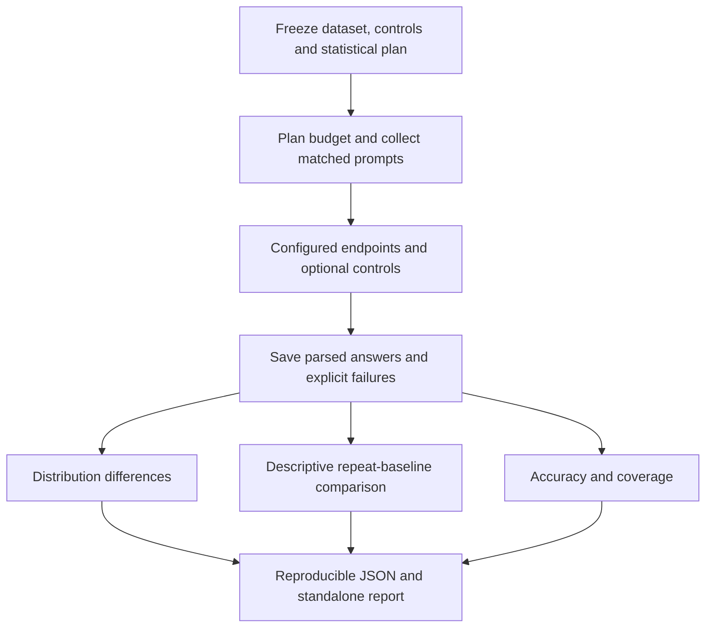

> **Trust but verify.** — Old Russian proverb

# Trust Me Bro Benchmark

**Do providers return statistically different answers under the same benchmark?**

Trust Me Bro (`tmb`) compares **two or more API endpoints claiming to serve the same model** and produces reproducible evidence about differences in their answer distributions on matched prompts. Start with DeepSeek, or point the same model-agnostic engine at any OpenAI-compatible chat API.

No leaderboard. No authenticity percentage. No majority vote that declares a winner.

[Published reports](reports/README.md) · [Quick start](#quick-start) · [Statistical comparison](#compare-a-published-dataset) · [Repeat baseline](#inspect-repeat-baseline-disagreement) · [MCP](docs/mcp.md) · [Documentation](docs/README.md)

## How it works



The same engine runs from the CLI or an MCP client. The report explains **what was compared, how large the differences were, and how much uncertainty remains**. It provides behavioral evidence; it cannot inspect remote weights. See [the module diagram](docs/architecture.md#inside-the-repository) and [the statistical outcomes](docs/interpreting-results.md#primary-outcomes).

## What the result means

An API-only test **cannot conclusively prove which weights a remote provider loaded**. Similar behavior does not establish authenticity. Agreement among most providers does not establish ground truth.

| Question | What `tmb` can say |
|---|---|
| Which providers behave differently? | **Relative comparison:** all N(N−1)/2 pairs, with samples and evidence. |
| Does a provider differ from a designated reference? | **Reference comparison:** the same corrected distribution test against your chosen endpoint. |
| Is this definitely the original checkpoint? | **Identity proof:** outside the scope of black-box behavioral testing. |

The primary question is whether providers' response distributions are statistically distinguishable on the tested prompts. Distribution-test verdicts are **detectably different**, **no difference detected**, or **inconclusive**. A completed valid test above the significance threshold means no difference was detected; a failed or incomplete test is inconclusive. Neither establishes equivalence. Every comparison reports effect size, coverage, uncertainty and limitations. Accuracy, latency and cost never become identity scores.

The optional repeat-baseline view reports disagreement and **descriptive bootstrap intervals only**. Version 0.3 stops issuing tolerance verdicts from that uncalibrated bootstrap. Historical 0.2 tolerance labels remain reproducible with an explicit warning; they are not validated equivalence conclusions.

**The bundled suite is a smoke test.** Its six statistical prompts are too narrow for a comprehensive checkpoint audit. An exact-string test can detect capitalization alone, such as `Biru` versus `biru`, even when both answers mean the same thing. Reports expose each probe's contribution so a narrow formatting signal is visible. See [datasets and stronger audit protocols](docs/datasets.md) before interpreting a live comparison.

## Quick start

Python 3.11 or newer. No API key, GPU, or paid request required for this example.

```sh
git clone https://github.com/NetraRuntime/trust-me-bro-benchmark.git
cd trust-me-bro-benchmark
python -m pip install -e .

tmb demo --output results/demo
tmb report results/demo/run/run.json
```

Open `results/demo/run/report.md`. The adjacent `run.json` is the machine-readable manifest and evidence bundle. The demo creates 300 synthetic questions and four mock endpoints: a reference, its repeat alias, a same-distribution candidate, and a different-distribution control. These are fixtures, not DeepSeek measurements; their accuracy has no capability meaning.

The demo uses a fixture-specific 12-point descriptive margin. Its bootstrap intervals do not establish tolerance or equivalence.

For a smaller smoke test, run `tmb benchmark --config examples/mock.yaml --level 1 --output results/quick`. That fixture has three endpoints and uses the original constrained-output suite.

Try the complete statistical workflow, including a designated mock reference:

```sh
tmb benchmark --config examples/mock.yaml --level 4 --output results/full
tmb report results/full/run.json
```

Using uv? Run `uv sync --extra dev --extra mcp --extra datasets`, then prefix commands with `uv run`.

## Inspect repeat-baseline disagreement

An optional descriptive view compares provider disagreement with variation between two independently queried aliases of one endpoint. Start from [consistency-providers.yaml](examples/consistency-providers.yaml), with a designated reference, an identically configured repeat alias, a candidate provider and a different-model control. The primary difference test does not require this view or an equivalence margin.

```yaml
consistency:
  baseline: [reference, reference_repeat]
  margin: 0.05
  min_questions: 100
  min_per_subject: 5
  max_missing_fraction: 0.05
sampling:
  bootstrap: 10000
  alpha: 0.05
```

Here, `0.05` means **five percentage points of excess answer disagreement** relative to the baseline, in either direction. It is an illustrative design choice, not a universal threshold or an authenticity percentage. Justify it using practical requirements and separate pilot questions; do not tune it on final evaluation responses.

Use the dataset commands below after configuring all four endpoints. The view reports the interval's position relative to the recorded margin, coverage limitations and different-model control separation. It always labels new results **descriptive only**: percentile bootstrap tail allocation does not establish simultaneous coverage, especially for rare question types. Missing responses widen worst-case bounds. Significance decisions come from the separate categorical MMD permutation test.

This estimates a specific observable: mean answer disagreement. Equal disagreement rates can conceal different distributions. Keep the separate categorical MMD test and question-level evidence in view. No majority vote establishes ground truth.

Read [the exact method and departures](docs/consistency.md), [report interpretation](docs/interpreting-results.md), and [configuration](docs/configuration.md).

## Use from an MCP client

```sh
python -m pip install -e '.[mcp]'
tmb-mcp --root /absolute/path/to/your/workspace
```

The stdio server exposes `plan_dataset`, `start_dataset`, `run_status`, `read_report`, and `tmb://methodology`. Runs execute in a background job. Real API requests require the server owner's explicit `--allow-network` startup option and per-run request, token and estimated-cost limits. Keys stay in the server environment.

See [client configuration, examples and recovery](docs/mcp.md). To create local fixtures for MCP without starting collection, run `tmb demo --output results/mcp-demo --prepare-only`.

## Compare a published dataset

For broader provider comparisons, use the **MMLU-Pro parsed-choice workflow**. It freezes a balanced selection across 14 subjects and compares actual selected answers. Letter case and simple formatting wrappers do not change a parsed answer. Accuracy, answer disagreement and statistical evidence are reported separately.

```sh
python -m pip install -e '.[datasets]'
# Copy examples/dataset-providers.yaml to providers.local.yaml and configure your endpoints.
tmb prepare-dataset --output results/mmlu-140.json --per-category 10 --seed 20260927
tmb compare-dataset --config providers.local.yaml --dataset results/mmlu-140.json --repeats 2 --workers 2 --output results/mmlu --dry-run
tmb compare-dataset --config providers.local.yaml --dataset results/mmlu-140.json --repeats 2 --workers 2 --output results/mmlu
tmb report results/mmlu/run.json --dataset results/mmlu-140.json
```

With 140 questions and two repeats, the plan uses **280 requests per configured endpoint**. Set limits and inspect the dry-run estimate before collection. Dataset download requires the optional `datasets` extra; offline reporting does not. With uv, use `uv sync --extra datasets --extra dev`.

The report includes per-subject accuracy, coverage, all pairwise answer comparisons, question-level disagreements, corrected p-values and uncertainty. A second identically configured endpoint can serve as an independent repeat control via `--same-configuration-pair NAME_A NAME_B`. This measures baseline variation without treating provider consensus as truth.

This is a sampled, zero-shot direct-answer adaptation, **not an official full MMLU-Pro score or an identity certificate**. Read the [complete frozen protocol](docs/dataset-protocol.md), [sample configuration](examples/dataset-providers.yaml), and [dataset selection guide](docs/datasets.md). The original cumulative levels remain available for smoke tests and diagnostic fingerprints.

## Compare real providers

Copy [`examples/providers.yaml`](examples/providers.yaml) to `providers.local.yaml`, replace the placeholder URLs and model identifiers, and set credentials in your shell. These are intentionally **not working hosts or real checkpoint names**.

```yaml
claimed_model: deepseek/example-checkpoint
endpoints:
  - name: netra
    base_url: https://example-netra.invalid/v1
    model: deepseek/example-checkpoint
    api_key_env: NETRA_API_KEY
  - name: provider_b
    base_url: https://example-b.invalid/v1
    model: deepseek/example-checkpoint
    api_key_env: PROVIDER_B_API_KEY
  - name: provider_c
    base_url: https://example-c.invalid/v1
    model: deepseek/example-checkpoint
    api_key_env: PROVIDER_C_API_KEY
# reference: provider_c  # Your designation, not independently certified truth.
```

Keys are read **only from environment variables**. `.env.example` lists their names; `.env` files are not automatically loaded. In Bash, read keys without echoing them or placing them in shell history:

```sh
read -rs -p 'Netra API key: ' NETRA_API_KEY; export NETRA_API_KEY; echo
read -rs -p 'Provider B API key: ' PROVIDER_B_API_KEY; export PROVIDER_B_API_KEY; echo
read -rs -p 'Provider C API key: ' PROVIDER_C_API_KEY; export PROVIDER_C_API_KEY; echo
```

In PowerShell 7, use `$env:NETRA_API_KEY = Read-Host 'Netra API key' -MaskInput` and repeat for the other names.

```sh
tmb benchmark --config providers.local.yaml --level 1 --dry-run
tmb benchmark --config providers.local.yaml --level 1 --output results/quick-live
tmb benchmark --config providers.local.yaml --level 3 --output results/full-live
tmb report results/full-live/run.json
```

Add as many endpoints as needed. A local reference uses the same adapter, for example `http://127.0.0.1:8000/v1`; omit `api_key_env` if it does not require authentication. A remote reference is always **user-designated**, never independently certified by this tool.

### DeepSeek through OpenRouter

[`examples/openrouter-v4-flash.yaml`](examples/openrouter-v4-flash.yaml) and [`examples/openrouter-v4.1-flash.yaml`](examples/openrouter-v4.1-flash.yaml) pin two provider routes with fallbacks disabled. Set `OPENROUTER_API_KEY`, inspect the dry run, then start at level 0 or 1. Check current availability and prices before running.

Compare each checkpoint in its **own run**. V4 Flash versus V4.1 Flash is a different-model control, not a same-checkpoint audit. Provider routing, aliases, and returned model IDs are claims to record, not evidence of weight identity.

## Choose your test budget

`--level K` runs levels **0 through K**. Defaults below are **per endpoint** for the bundled suite; multiply by N endpoints. Output caps exclude the input reservation shown by `--dry-run`.

| Level | Method and interpretation | New requests | New output cap | Cumulative requests |
|---|---|---:|---:|---:|
| **0 · Sanity** | Compatibility probe; requested controls, IDs, metadata and failures. Setup evidence only. | 1 | 16 tokens | 1 |
| **1 · Quick fingerprint** | Four multilingual constrained prompts × 8 repeats; empirical JSD and within-endpoint split halves. Descriptive, no universal threshold. | 32 | 512 tokens | 33 |
| **2 · Active probes** | Six formatting, language, reasoning and version-sensitive tasks × 2 repeats. Describe disagreements; no accuracy-based identity score. | 12 | 1,536 tokens | 45 |
| **3 · Distribution test** | Six fixed prompts × 20 repeats; exact-string MMD permutation test, effect estimate and Holm-adjusted p-value. | 120 | 15,360 tokens | 165 |
| **4 · Reference audit** | Separate reference view of level-3 comparisons; reuses samples and correction. Optional. | 0 | 0 tokens | 165 |

Level 1 uses short **constrained answers**, not a claim that all answers occupy one token. Truncated responses make affected comparisons inconclusive. The optional rank-based uniformity test is **not implemented**.

Default run limits are 1,000 requests and 200,000 reserved input-plus-output tokens. Limits, repeats, output caps, timeouts, prices and estimated cost ceilings are [configurable](docs/configuration.md). There are no automatic API retries. Requests are sequential, with randomized endpoint order inside prompt/repeat blocks.

Token reservations and price estimates are not remote billing guarantees. Missing prices or usage are reported as unknown. Latency and spend stay separate from behavioral conclusions.

## Read the evidence

Each run writes:

* **`run.json`** — run ID, version, sanitized config, suite hash, settings, UTC timestamps, request statuses, response IDs, hashes, token usage, costs and statistical results.
* **`report.md`** — standalone report with an N × N matrix for every requested level, pairwise evidence, per-probe observations, response representatives, and a separate reference section at level 4.

Failures never disappear from a pair. Transport failures, HTTP errors, missing credentials, refusals, truncations, empty responses and suspected cached completions have explicit statuses. The original distribution tests retain their strict rule: any missing or invalid required sample makes that test inconclusive. The optional descriptive baseline view propagates missing-answer bounds and displays coverage limitations; it does not override the statistical verdict. No string collisions or insufficient permutation resolution also yields an inconclusive legacy level-3 result.

Reports retain response hashes by default. They preserve exact equality, permitting offline reproduction of this implementation's JSD and MMD analysis. Use `--store-text` to inspect redacted response wording; this is necessary for semantic disagreement review, and can still expose personal data. Private prompts are never saved automatically. Read the [privacy guidance](docs/privacy.md).

Reports validate the recorded protocol hash and observation slots before analysis. New dataset manifests also bind item metadata to that hash. Supply `tmb report RUN/run.json --dataset FROZEN.json` to verify the saved labels and prompt hashes against the original dataset. Without it, reports explicitly mark original-dataset linkage unverified. Local hashes detect inconsistent edits, not forgery or actual preregistration. Shared API request seeds are rejected for statistical collection; keep `sampling.request_seed: null`. The local `random_seed` still makes scheduling and offline analysis reproducible.

### Resume a run

```sh
tmb benchmark --config providers.local.yaml --level 3 --output results/full-live --resume
```

Keep the config, suite, level, tool version and `--store-text` policy unchanged. Completed and failed requests are not resent. An interrupted in-flight request becomes `interrupted_unknown`; the server may already have billed it, so resume does not silently resend it. That pair remains inconclusive. Start a new run to recollect a complete protocol.

For dataset runs, repeat the original `compare-dataset` command with `--resume`, preserving dataset, repeats, workers and optional baseline settings. Version 0.3 can validate and render 0.1/0.2 reports; resuming old collections requires their original version. Historical seeded statistical runs are rendered as inconclusive because their sampling independence is not established.

The manifest is replaced atomically after each request. Brief local file locks receive a bounded replacement retry; this never resends an API request. A lock prevents concurrent writers. After a hard process kill, remove `results/full-live/.run.lock` **only after confirming no runner still uses it**. Budget exhaustion cannot be bypassed by resume; changing the budget requires a new run.

## Scientific scope

This is a behavioral evidence tool, not a model-authentication product. The new protocol measures a concurrent repeat baseline; synthetic controls test its implementation, but do not establish live-provider coverage or general power. The public suite can be recognized by a provider.

* **Relative evidence:** compare every pair; never crown the largest cluster as ground truth.
* **Reference evidence:** match checkpoint revision, tokenizer, template, reasoning mode and requested controls. Known differences limit attribution; unknown settings remain caveats.
* **Statistical evidence:** distinguish significance from effect size. A lack of rejection may reflect insufficient samples or an insensitive kernel.
* **Adversarial limits:** hidden probes do not guarantee robustness against selective routing, spoofing, shared upstreams or drift.

See [the exact procedure and departures from the papers](docs/methodology.md) and [the threat model](docs/threat-model.md).

## Research

1. Gao, Liang & Guestrin. **Model Equality Testing: Which Model Is This API Serving?** ICLR 2025. [Paper](https://arxiv.org/abs/2410.20247) · [Research code](https://github.com/i-gao/model-equality-testing). Informs the two-sample framing and MMD test.
2. Zhu et al. **Auditing Black-Box LLM APIs with a Rank-Based Uniformity Test.** [Paper](https://arxiv.org/abs/2506.06975). An additional reference-audit method; not implemented here.
3. Bruckner. **One Token Is Enough: Fingerprinting and Verifying Large Language Models from Single-Token Output Distributions.** [Paper](https://arxiv.org/abs/2607.10252). Motivates short-output fingerprints; its verification thresholds are not transferred here.
4. Pasquini, Kornaropoulos & Ateniese. **LLMmap: Fingerprinting for Large Language Models.** USENIX Security 2025. [Paper and presentation](https://www.usenix.org/conference/usenixsecurity25/presentation/pasquini). Motivates varied active probes; this repo does not reproduce its trained classifier.
5. Zhang, Li & Wang. **Your “Pro” LLM Subscription May Actually Be “Free”: Exposing Fingerprint Spoofing Risks in LLM Inference Services.** [Paper](https://arxiv.org/abs/2606.16100). Informs the limits of fingerprinting under adversarial providers.
6. **KBF: Knowledge Boundary as Fingerprint for Language Model and Black-Box API Auditing.** May 2026 preprint. [Paper](https://arxiv.org/abs/2605.29524) · [Code and reference probe sets](https://github.com/Ooo0ption/KBF). A candidate for calibrated numerical-answer audits; not implemented here.

For available datasets, scope, and integration requirements, read the [dataset guide](docs/datasets.md).

## Contribute

```sh
python -m pip install -e '.[dev,mcp]'
python -m pytest -q
ruff check .
```

The code separates [adapters](src/tmb/adapters.py), [probes](src/tmb/probes.py), [orchestration](src/tmb/runner.py), [statistics](src/tmb/statistics.py), [analysis](src/tmb/analysis.py) and [reporting](src/tmb/report.py). Offline tests require no credentials and make no network requests.

See [CONTRIBUTING.md](CONTRIBUTING.md), [architecture](docs/architecture.md), and [CHANGELOG.md](CHANGELOG.md) for protocol changes and reproducibility requirements. Never commit credentials, private probes, or real paid API results. See [SECURITY.md](SECURITY.md) for private vulnerability reporting.

Licensed under the OSI-approved [MIT License](LICENSE).
