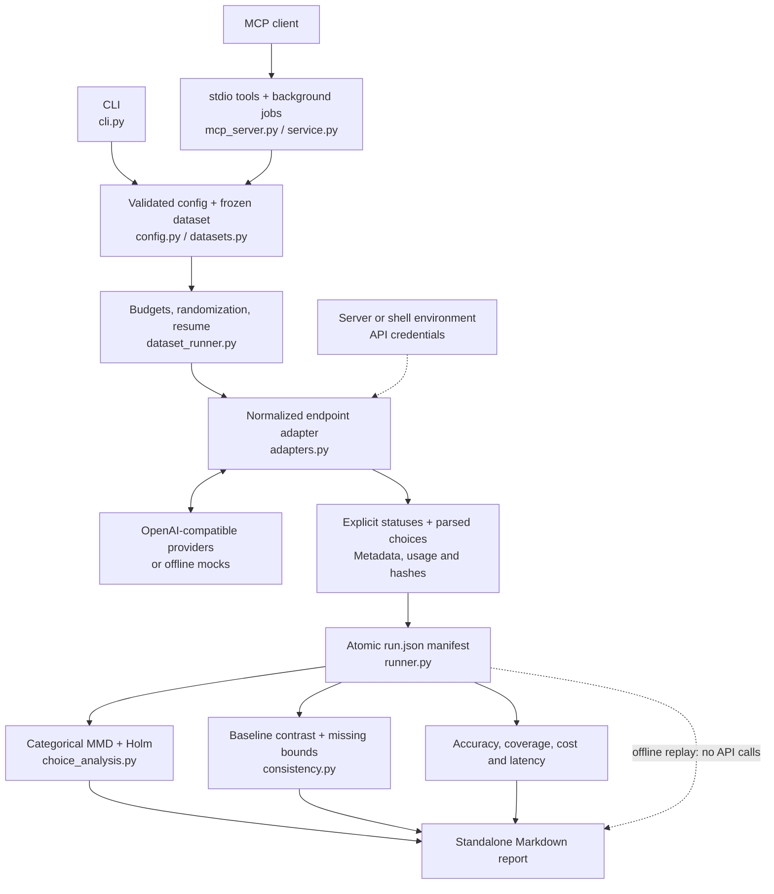
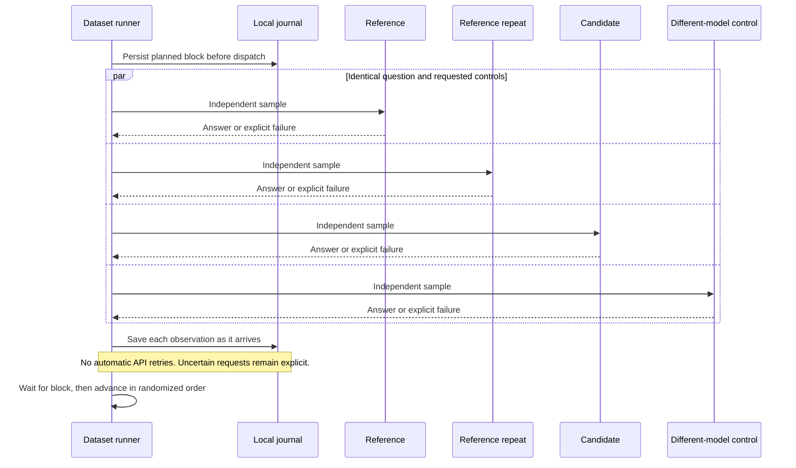

# Architecture and extension points

The CLI and MCP server share the same configuration, dataset runner and analysis functions. MCP adds workspace boundaries, background jobs and server-side limits; it does not implement a second statistical engine.

## Inside the repository



Credentials enter only the adapter's authorization header. The manifest records environment-variable names and sanitized observations, not keys. Offline replay recomputes statistics from those observations; it does not ask a provider to reproduce an earlier response. The legacy `benchmark` command uses `probes.py`, `runner.py` and `analysis.py` for cumulative levels 0–4.

## What one collection block contains



Concurrency is bounded by `--workers`. Every question is collected for the predeclared number of repeats. A timeout does not disappear or silently become a replacement sample.

| Module | Responsibility |
|---|---|
| `config.py` | Strict Pydantic schema, endpoint provenance, budgets and consistency predeclaration |
| `adapters.py` | Request payloads, environment credentials, normalized observations and redaction |
| `probes.py`, `datasets.py` | Versioned smoke probes, pinned dataset acquisition and frozen choice parser |
| `runner.py` | Legacy level scheduling, reservations, atomic manifests and locks |
| `dataset_runner.py` | Randomized question/endpoint blocks, bounded concurrency and resumable collection |
| `statistics.py`, `analysis.py` | Legacy JSD/MMD estimates, permutation tests and corrections |
| `choice_analysis.py` | Parsed-choice distribution tests, task scores and dataset report rendering |
| `dataset_diagnostics.py` | Descriptive missing-answer agreement bounds |
| `consistency.py` | Paired baseline contrasts, missingness propagation, approximate bootstrap intervals and decision gates |
| `service.py`, `mcp_server.py` | Workspace-scoped service and optional official-SDK stdio interface |
| `demo.py` | Public deterministic synthetic fixtures; no live measurements |

## Collection contract

Adapters return status, visible text when available, response metadata, usage and latency. They do not retry paid calls or expose response error bodies. The runner journals requests before dispatch and persists each observation atomically. Statistical input is parsed choices for datasets and credential-redacted string hashes for legacy probes. Reasoning traces are not analyzed.

Resume checks the protocol fingerprint and retains attempted failures. An uncertain in-flight request becomes `interrupted_unknown`. Callers must never rebuild a partially successful run by silently discarding request rows. Provider errors and unparseable responses are distinct statuses, not absent providers.

## Add a method or dataset

Define the estimand, sampling unit, null or practical tolerance, missingness policy, correction family and failure gates before implementing the estimator. Version parsers and methods when their interpretation changes. Preserve old manifests and reproducible rendering; do not retrofit a new confirmatory declaration onto historical observations.

Dataset provenance includes an immutable upstream revision and content hash. Store gold labels locally, never in prompts. New task types need dedicated parsers or scorers, rather than global string normalization. Accuracy and identity-oriented observables remain separate. A new adapter must preserve requested controls and explain unsupported capabilities.

## Test and build

```sh
python -m pip install -e '.[dev,mcp]'
python -m pytest -q
ruff check .
```

The suite is offline: adapter responses are mocked, statistical tests use synthetic distributions, and MCP tests launch a real stdio server with mock providers. CI covers Python 3.11–3.13 on Windows and Linux and installs the MCP extra so its integration test cannot silently skip. Dataset downloading is an optional extra and is not required by the tests.

The `[datasets]` extra supplies PyArrow only for preparing the public dataset; NumPy handles analysis. The `[mcp]` extra supplies the official SDK. The base CLI and offline reports do not import MCP. Build a wheel with `uv build`, then install it in a fresh environment to check entry points and optional dependencies.
