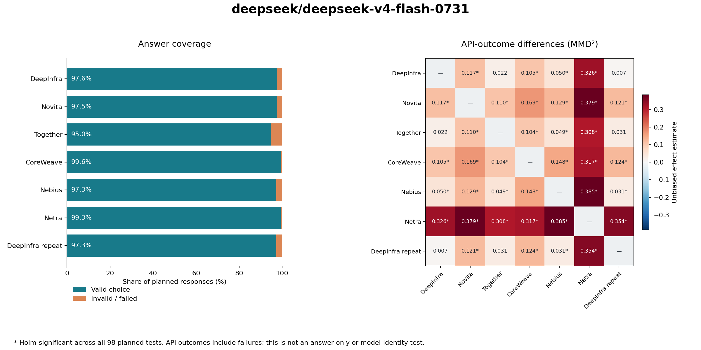

# DeepSeek V4 Flash 0731 — provider comparison

**280 questions · 14 subjects · 4 repeats · 6 providers + repeat control · 2,048-token ceiling**

Collection window (UTC): **2026-09-27T17:27:05.843044+00:00 → 2026-09-27T18:54:24.052297+00:00**. Report series dated 28 September 2026 in Asia/Bangkok.

## Results at a glance

**7,657/7,840 valid parsed answers (97.67%).** All 7,840 planned attempts are recorded; no failed request was retried.

| Analysis | Detectably different | No difference detected | Inconclusive |
|---|---:|---:|---:|
| Answer choices (primary) | 0 | 0 | 21 |
| API outcomes (supplement) | 18 | 3 | 0 |

All significance decisions use one Holm correction across **98 planned comparisons across both model reports**, at family alpha 0.05. Counts include repeat-control comparisons. A completed nonsignificant test is distinct from an inconclusive test.

The API-outcome supplement counts either the returned option letter or a failure status. It can detect formatting or availability differences; it does not establish different substantive answers or model weights. The answer-only test requires every planned answer to be valid.

**The primary answer-only study is inconclusive for every pair because its complete-protocol requirements were not met.** The coverage and outcome results below do not turn that into evidence of equal answer distributions.

**Direct Netra API versus OpenRouter routes (API outcomes):** Detectably different from DeepInfra, Novita, Together, CoreWeave, Nebius.



## Coverage, task accuracy and request latency

Accuracy is correct/planned. Its range below allows every missing or invalid answer to be wrong or correct; it is a finite-sample bound, not a confidence interval. Latency is client-observed, non-streaming latency for HTTP-200 responses, including formatting failures. It is descriptive, not isolated inference throughput or time to first token.

| Provider | Valid / planned | Correct / planned | Accuracy bounds | HTTP-200 latency p50 / p95 | Known-usage estimate |
|---|---:|---:|---:|---:|---:|
| DeepInfra | 1093/1120 | 617/1120 (55.09%) | 55.09%–57.50% | 0.98s / 2.08s | $0.0143 |
| Novita | 1092/1120 | 611/1120 (54.55%) | 54.55%–57.05% | 1.22s / 1.86s | $0.0962 |
| Together | 1064/1120 | 594/1120 (53.04%) | 53.04%–58.04% | 1.22s / 6.19s | $0.0323 |
| CoreWeave | 1116/1120 | 599/1120 (53.48%) | 53.48%–53.84% | 0.75s / 1.70s | $0.0306 |
| Nebius | 1090/1120 | 617/1120 (55.09%) | 55.09%–57.77% | 1.08s / 1.86s | $0.0335 |
| Netra | 1112/1120 | 651/1120 (58.13%) | 58.13%–58.84% | 0.42s / 0.75s | $0.0472 |
| DeepInfra repeat | 1090/1120 | 603/1120 (53.84%) | 53.84%–56.52% | 1.00s / 2.08s | $0.0143 |

Total known-usage estimate: **$0.2684**. Requests missing complete token usage: **31**. These are listed-price estimates, not receipts; unknown failed-request billing, cache discounts and fees are not resolved.

### Observed token usage

2,048 is an output ceiling, not a target response length. This direct-answer task requests a single option letter. The table summarizes reported usage where available; it does not measure sustained long-output throughput. Token accounting is reported by each endpoint and may differ between providers.

| Provider | Requests with input/output usage | Input tokens p50 | Output tokens p50 / p95 / maximum |
|---|---:|---:|---:|
| DeepInfra | 1120 | 167.5 | 2.0 / 3.0 / 16 |
| Novita | 1120 | 167.5 | 1.0 / 2.0 / 110 |
| Together | 1089 | 168.0 | 2.0 / 3.0 / 299 |
| CoreWeave | 1120 | 167.5 | 2.0 / 2.0 / 9 |
| Nebius | 1120 | 167.5 | 2.0 / 3.0 / 2048 |
| Netra | 1120 | 167.5 | 2.0 / 2.0 / 8 |
| DeepInfra repeat | 1120 | 167.5 | 2.0 / 3.0 / 223 |

### Failure accounting

| Provider | Recorded non-success statuses | HTTP error codes |
|---|---|---|
| DeepInfra | unparseable: 27 | None |
| Novita | unparseable: 28 | None |
| Together | http_error: 31, unparseable: 25 | 429: 30, 502: 1 |
| CoreWeave | unparseable: 4 | None |
| Nebius | truncated: 1, unparseable: 29 | None |
| Netra | unparseable: 8 | None |
| DeepInfra repeat | unparseable: 30 | None |

## Pairwise statistical results

MMD² is the mean unbiased categorical effect estimate; negative estimates are allowed. Bracketed 95% bootstrap intervals are descriptive and pointwise, not simultaneous confidence guarantees. The p-values below are campaign-adjusted. A dash indicates that inference was invalid, not p=0 or nonsignificance.

| Pair | Answer result | Answer MMD² [interval] | Adjusted p | API-outcome result | Outcome MMD² [interval] | Adjusted p |
|---|---|---:|---:|---|---:|---:|
| DeepInfra / Novita | inconclusive | — | — | detectably different | 0.1168 [0.0746, 0.1583] | 0.00098 |
| DeepInfra / Together | inconclusive | — | — | no difference detected | 0.0223 [-0.0003, 0.0467] | 0.73188 |
| DeepInfra / CoreWeave | inconclusive | — | — | detectably different | 0.1054 [0.0677, 0.1463] | 0.00098 |
| DeepInfra / Nebius | inconclusive | — | — | detectably different | 0.0497 [0.0211, 0.0823] | 0.00098 |
| DeepInfra / Netra | inconclusive | — | — | detectably different | 0.3260 [0.2577, 0.3954] | 0.00098 |
| DeepInfra / DeepInfra repeat | inconclusive | — | — | no difference detected | 0.0070 [-0.0086, 0.0247] | 1.00000 |
| Novita / Together | inconclusive | — | — | detectably different | 0.1100 [0.0701, 0.1531] | 0.00098 |
| Novita / CoreWeave | inconclusive | — | — | detectably different | 0.1689 [0.1173, 0.2237] | 0.00098 |
| Novita / Nebius | inconclusive | — | — | detectably different | 0.1289 [0.0836, 0.1786] | 0.00098 |
| Novita / Netra | inconclusive | — | — | detectably different | 0.3793 [0.3088, 0.4538] | 0.00098 |
| Novita / DeepInfra repeat | inconclusive | — | — | detectably different | 0.1214 [0.0807, 0.1631] | 0.00098 |
| Together / CoreWeave | inconclusive | — | — | detectably different | 0.1039 [0.0644, 0.1451] | 0.00098 |
| Together / Nebius | inconclusive | — | — | detectably different | 0.0491 [0.0213, 0.0842] | 0.00098 |
| Together / Netra | inconclusive | — | — | detectably different | 0.3085 [0.2426, 0.3784] | 0.00098 |
| Together / DeepInfra repeat | inconclusive | — | — | no difference detected | 0.0310 [0.0064, 0.0576] | 0.14049 |
| CoreWeave / Nebius | inconclusive | — | — | detectably different | 0.1482 [0.1004, 0.2016] | 0.00098 |
| CoreWeave / Netra | inconclusive | — | — | detectably different | 0.3170 [0.2463, 0.3872] | 0.00098 |
| CoreWeave / DeepInfra repeat | inconclusive | — | — | detectably different | 0.1238 [0.0820, 0.1680] | 0.00098 |
| Nebius / Netra | inconclusive | — | — | detectably different | 0.3845 [0.3082, 0.4624] | 0.00098 |
| Nebius / DeepInfra repeat | inconclusive | — | — | detectably different | 0.0311 [0.0098, 0.0570] | 0.04148 |
| Netra / DeepInfra repeat | inconclusive | — | — | detectably different | 0.3539 [0.2839, 0.4249] | 0.00098 |

**Repeat control:** no difference detected for API outcomes (campaign-adjusted p=1.00000). These aliases query the same configuration; shared infrastructure remains possible. This single comparison is not a calibrated false-positive-rate estimate.

## Agreement with missing-answer bounds

Every missing cross-response comparison is allowed either to agree or disagree. These finite-sample bounds preserve failures; they are not population confidence intervals or proof of equivalence.

| Pair | Agreement lower bound | Agreement upper bound | Observed / planned comparisons |
|---|---:|---:|---:|
| DeepInfra / Novita | 80.56% | 84.75% | 4292/4480 |
| DeepInfra / Together | 81.79% | 88.24% | 4191/4480 |
| DeepInfra / CoreWeave | 79.15% | 81.79% | 4362/4480 |
| DeepInfra / Nebius | 85.09% | 89.15% | 4298/4480 |
| DeepInfra / Netra | 70.87% | 73.91% | 4344/4480 |
| DeepInfra / DeepInfra repeat | 85.25% | 89.26% | 4300/4480 |
| Novita / Together | 78.06% | 84.93% | 4172/4480 |
| Novita / CoreWeave | 76.45% | 79.26% | 4354/4480 |
| Novita / Nebius | 81.85% | 86.34% | 4279/4480 |
| Novita / Netra | 68.57% | 71.67% | 4341/4480 |
| Novita / DeepInfra repeat | 80.22% | 84.64% | 4282/4480 |
| Together / CoreWeave | 76.27% | 81.47% | 4247/4480 |
| Together / Nebius | 82.37% | 89.15% | 4176/4480 |
| Together / Netra | 68.75% | 74.31% | 4231/4480 |
| Together / DeepInfra repeat | 81.32% | 88.04% | 4179/4480 |
| CoreWeave / Nebius | 78.84% | 81.70% | 4352/4480 |
| CoreWeave / Netra | 69.22% | 70.27% | 4433/4480 |
| CoreWeave / DeepInfra repeat | 78.15% | 81.03% | 4351/4480 |
| Nebius / Netra | 69.82% | 73.12% | 4332/4480 |
| Nebius / DeepInfra repeat | 85.76% | 89.89% | 4295/4480 |
| Netra / DeepInfra repeat | 69.38% | 72.63% | 4334/4480 |

## Subject-level results

Each cell is correct / planned responses. Invalid or unavailable answers receive no credit; this is not an official leaderboard score.

| Subject | DeepInfra | Novita | Together | CoreWeave | Nebius | Netra |
|---|---:|---:|---:|---:|---:|---:|
| biology | 75/80 | 76/80 | 75/80 | 72/80 | 76/80 | 76/80 |
| business | 48/80 | 43/80 | 45/80 | 44/80 | 43/80 | 40/80 |
| chemistry | 22/80 | 25/80 | 23/80 | 27/80 | 20/80 | 38/80 |
| computer science | 48/80 | 52/80 | 47/80 | 44/80 | 50/80 | 42/80 |
| economics | 56/80 | 56/80 | 56/80 | 53/80 | 58/80 | 60/80 |
| engineering | 19/80 | 16/80 | 16/80 | 16/80 | 16/80 | 29/80 |
| health | 52/80 | 54/80 | 55/80 | 58/80 | 55/80 | 67/80 |
| history | 53/80 | 54/80 | 46/80 | 44/80 | 55/80 | 44/80 |
| law | 26/80 | 26/80 | 26/80 | 27/80 | 24/80 | 25/80 |
| math | 36/80 | 26/80 | 34/80 | 31/80 | 36/80 | 42/80 |
| other | 44/80 | 41/80 | 44/80 | 39/80 | 44/80 | 38/80 |
| philosophy | 40/80 | 44/80 | 38/80 | 50/80 | 45/80 | 52/80 |
| physics | 39/80 | 40/80 | 33/80 | 38/80 | 37/80 | 41/80 |
| psychology | 59/80 | 58/80 | 56/80 | 56/80 | 58/80 | 57/80 |

## Illustrative question-level disagreement

The following questions have the largest observed cross-provider disagreement among valid choices, excluding the repeat alias. They are selected descriptively after collection, not additional significance tests. Counts show repeated choices; missing responses remain missing.

| Question ID | Subject | Gold | DeepInfra | Novita | Together | CoreWeave | Nebius | Netra |
|---|---|---|---|---|---|---|---|---|
| 1002 | law | E | F×2, H×1, I×1 | I×1, J×3 | H×3, J×1 | A×1, B×2, F×1 | F×3, G×1 | H×4 |
| 12037 | engineering | D | D×1, F×3 | J×4 | B×2, F×2 | B×2, D×1, G×1 | D×3, F×1 | D×3, H×1 |
| 10853 | philosophy | A | F×4 | B×2, F×2 | A×3, F×1 | A×4 | A×2, B×1, J×1 | G×1, H×3 |
| 11350 | engineering | C | F×3, J×1 | C×1, F×3 | F×2, J×2 | H×4 | C×1, J×3 | G×1, H×3 |
| 11394 | engineering | D | B×1, F×1, J×1; missing 1 | J×4 | C×1, F×1, J×1; missing 1 | B×1, F×2, H×1 | F×1, J×3 | H×4 |
| 9029 | math | C | C×1, J×1; missing 2 | F×3; missing 1 | J×4 | J×4 | F×4 | C×4 |
| 7084 | economics | E | I×4 | B×1, E×3 | B×2, E×2 | B×3, I×1 | E×1, I×1; missing 2 | E×4 |
| 1159 | law | D | D×2, I×2 | D×3, I×1 | D×2, I×2 | B×2, D×1, F×1 | D×2, I×2 | C×1, D×1, H×2 |
| 4581 | chemistry | H | F×2, J×2 | F×1, H×1, J×1; missing 1 | F×2, H×1; missing 1 | F×1, H×2, J×1 | F×1, J×3 | H×4 |
| 5349 | other | I | H×2, I×1, J×1 | F×2, H×2 | D×1, H×2; missing 1 | B×1, D×1, H×2 | D×1, F×2, I×1 | H×4 |
| 5566 | other | A | F×2, J×2 | F×2, H×1, J×1 | F×4 | F×1, H×2, J×1 | F×2, I×1; missing 1 | H×4 |
| 4062 | chemistry | E | D×1, G×3 | D×3, E×1 | D×1, E×1, G×2 | E×2, G×2 | G×4 | E×4 |

## Exact routes and controls

| Provider | Access path | Pinned route | Catalog precision | Returned model metadata |
|---|---|---|---|---|
| DeepInfra | OpenRouter | `deepinfra/fp8` | fp8 | `deepseek/deepseek-v4-flash-0731` |
| Novita | OpenRouter | `novita/fp8` | fp8 | `deepseek/deepseek-v4-flash-0731` |
| Together | OpenRouter | `together` | unknown | `deepseek/deepseek-v4-flash-0731` |
| CoreWeave | OpenRouter | `coreweave/fp8` | fp8 | `deepseek/deepseek-v4-flash-0731` |
| Nebius | OpenRouter | `nebius/fp8` | fp8 | `deepseek/deepseek-v4-flash-0731` |
| Netra | Direct Netra API | `deepseek/deepseek-v4-flash-0731` | unknown | `deepseek/deepseek-v4-flash-0731` |
| DeepInfra repeat | OpenRouter | `deepinfra/fp8` | fp8 | `deepseek/deepseek-v4-flash-0731` |

Requested settings: temperature 0.6, top-p 1, reasoning disabled, max output 2,048 tokens, no API seed, 120-second timeout, no retries and no provider fallback. Exact-tag routing and returned metadata were checked. Metadata is a provider assertion, not independent attestation of weights or precision. Advertised precision comes from the [pre-collection catalog snapshot](route-catalog.json); unknown remains unknown.

## Method and limitations

The [protocol](PROTOCOL.md) was published before main collection in commit [`4ecc14f`](https://github.com/NetraRuntime/trust-me-bro-benchmark/commit/4ecc14fe32cebd0fbb4528c3b331c92ad5211ca2). Its categorical MMD/permutation procedure uses 99,999 permutations, with one Holm family across both reports and both observables. Questions receive equal weight. The 2,000 subject-stratified bootstrap draws provide descriptive intervals in the analysis JSON.

This is a balanced zero-shot direct-answer subset, not an official MMLU-Pro leaderboard score. The small independent setup pilot is excluded. Providers were curated for availability; the roster is not exhaustive. For V4 Flash 0731, Parasail was excluded before evaluation after six pilot HTTP-429 failures, as recorded in the protocol.

Public benchmark contamination, correlated questions, hidden serving controls, temporal drift, cache behavior and cross-provider shared infrastructure limit generalization. A failed or invalid answer can reflect formatting rather than knowledge. The API-outcome test includes that distinction as observable behavior; it cannot resolve the underlying cause. HTTP-429 responses may reflect provider, router or account limits: error bodies and retry headers are not retained, so their origin is not established. Main-run raw response text was not retained: readers can reproduce the statistics, but cannot independently reparse the original responses. Four repeats per question do not guarantee power against subtle differences. No equivalence or model-identity claim is made.

## Evidence and reproduction

- [Reviewed observations](evidence/deepseek-v4-flash-0731.json.gz), with raw text and provider response IDs excluded.
- [Combined campaign analysis](campaign-analysis.json.gz), containing per-question effects, descriptive intervals and both correction scopes.
- [Frozen dataset](dataset.json), [independent source verification](dataset-verification.json), [protocol](protocol.json) and [pilot accounting](pilot-summary.json).
- [Recorded runtime versions](runtime.json); dependency resolution is retained in the repository's `uv.lock`.
- [Dataset attribution and selection](DATASET.md).
- [Independent result verification](result-verification.json), recomputed directly from the reviewed observations.
- [Exact configuration](configs/deepseek-v4-flash-0731.yaml).

```sh
python -m pip install -e .
python reports/2026-09-28-deepseek/analyze.py
python reports/2026-09-28-deepseek/verify_results.py
```

Reproduction is offline and makes no inference requests. The generic `tmb report` uses a narrower single-run correction; use the campaign script to reproduce the published cross-study correction.
