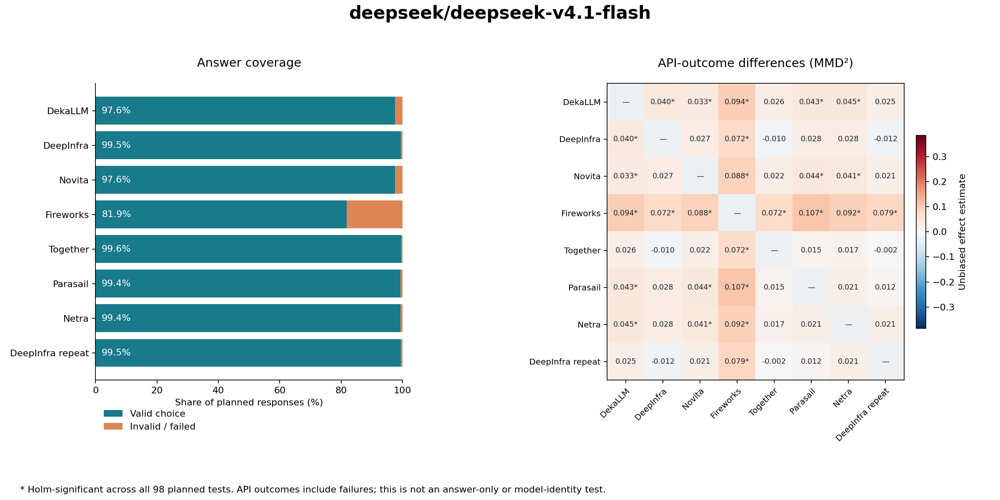

# DeepSeek V4.1 Flash — provider comparison

**280 questions · 14 subjects · 4 repeats · 7 providers + repeat control · 2,048-token ceiling**

Collection window (UTC): **2026-09-27T17:27:05.842044+00:00 → 2026-09-27T19:29:23.849787+00:00**. Report series dated 28 September 2026 in Asia/Bangkok.

## Results at a glance

**8,673/8,960 valid parsed answers (96.80%).** All 8,960 planned attempts are recorded; no failed request was retried.

| Analysis | Detectably different | No difference detected | Inconclusive |
|---|---:|---:|---:|
| Answer choices (primary) | 0 | 0 | 28 |
| API outcomes (supplement) | 13 | 15 | 0 |

All significance decisions use one Holm correction across **98 planned comparisons across both model reports**, at family alpha 0.05. Counts include repeat-control comparisons. A completed nonsignificant test is distinct from an inconclusive test.

The API-outcome supplement counts either the returned option letter or a failure status. It can detect formatting or availability differences; it does not establish different substantive answers or model weights. The answer-only test requires every planned answer to be valid.

**The primary answer-only study is inconclusive for every pair because its complete-protocol requirements were not met.** The coverage and outcome results below do not turn that into evidence of equal answer distributions.

**Direct Netra API versus OpenRouter routes (API outcomes):** Detectably different from DekaLLM, Novita, Fireworks. No difference detected against DeepInfra, Together, Parasail.



## Coverage, task accuracy and request latency

Accuracy is correct/planned. Its range below allows every missing or invalid answer to be wrong or correct; it is a finite-sample bound, not a confidence interval. Latency is client-observed, non-streaming latency for HTTP-200 responses, including formatting failures. It is descriptive, not isolated inference throughput or time to first token.

| Provider | Valid / planned | Correct / planned | Accuracy bounds | HTTP-200 latency p50 / p95 | Known-usage estimate |
|---|---:|---:|---:|---:|---:|
| DekaLLM | 1093/1120 | 818/1120 (73.04%) | 73.04%–75.45% | 0.64s / 1.58s | $0.0291 |
| DeepInfra | 1114/1120 | 816/1120 (72.86%) | 72.86%–73.39% | 1.30s / 3.67s | $0.0338 |
| Novita | 1093/1120 | 824/1120 (73.57%) | 73.57%–75.98% | 1.16s / 1.80s | $0.0466 |
| Fireworks | 917/1120 | 692/1120 (61.79%) | 61.79%–79.91% | 0.97s / 2.31s | $0.0441 |
| Together | 1116/1120 | 825/1120 (73.66%) | 73.66%–74.02% | 0.69s / 2.86s | $0.0731 |
| Parasail | 1113/1120 | 829/1120 (74.02%) | 74.02%–74.64% | 0.67s / 10.48s | $0.0730 |
| Netra | 1113/1120 | 817/1120 (72.95%) | 72.95%–73.57% | 1.42s / 3.88s | $0.0743 |
| DeepInfra repeat | 1114/1120 | 819/1120 (73.12%) | 73.12%–73.66% | 1.33s / 3.63s | $0.0335 |

Total known-usage estimate: **$0.4076**. Requests missing complete token usage: **240**. These are listed-price estimates, not receipts; unknown failed-request billing, cache discounts and fees are not resolved.

### Observed token usage

2,048 is an output ceiling, not a target response length. This direct-answer task requests a single option letter. The table summarizes reported usage where available; it does not measure sustained long-output throughput. Token accounting is reported by each endpoint and may differ between providers.

| Provider | Requests with input/output usage | Input tokens p50 | Output tokens p50 / p95 / maximum |
|---|---:|---:|---:|
| DekaLLM | 1101 | 167.0 | 2.0 / 2.0 / 822 |
| DeepInfra | 1120 | 167.5 | 2.0 / 2.0 / 473 |
| Novita | 1097 | 167.0 | 1.0 / 1.0 / 1850 |
| Fireworks | 925 | 167.0 | 2.0 / 2.0 / 801 |
| Together | 1120 | 167.5 | 2.0 / 2.0 / 550 |
| Parasail | 1118 | 167.5 | 2.0 / 2.0 / 404 |
| Netra | 1120 | 167.5 | 2.0 / 2.0 / 826 |
| DeepInfra repeat | 1119 | 167.0 | 2.0 / 2.0 / 476 |

### Failure accounting

| Provider | Recorded non-success statuses | HTTP error codes |
|---|---|---|
| DekaLLM | http_error: 19, unparseable: 8 | 429: 19 |
| DeepInfra | unparseable: 6 | None |
| Novita | http_error: 23, unparseable: 4 | 429: 23 |
| Fireworks | http_error: 195, unparseable: 8 | 429: 195 |
| Together | unparseable: 4 | None |
| Parasail | timeout: 2, unparseable: 5 | None |
| Netra | unparseable: 7 | None |
| DeepInfra repeat | http_error: 1, unparseable: 5 | 429: 1 |

## Pairwise statistical results

MMD² is the mean unbiased categorical effect estimate; negative estimates are allowed. Bracketed 95% bootstrap intervals are descriptive and pointwise, not simultaneous confidence guarantees. The p-values below are campaign-adjusted. A dash indicates that inference was invalid, not p=0 or nonsignificance.

| Pair | Answer result | Answer MMD² [interval] | Adjusted p | API-outcome result | Outcome MMD² [interval] | Adjusted p |
|---|---|---:|---:|---|---:|---:|
| DekaLLM / DeepInfra | inconclusive | — | — | detectably different | 0.0405 [0.0185, 0.0653] | 0.00210 |
| DekaLLM / Novita | inconclusive | — | — | detectably different | 0.0332 [0.0103, 0.0595] | 0.02553 |
| DekaLLM / Fireworks | inconclusive | — | — | detectably different | 0.0943 [0.0609, 0.1345] | 0.00098 |
| DekaLLM / Together | inconclusive | — | — | no difference detected | 0.0262 [0.0057, 0.0507] | 0.11520 |
| DekaLLM / Parasail | inconclusive | — | — | detectably different | 0.0433 [0.0159, 0.0729] | 0.00146 |
| DekaLLM / Netra | inconclusive | — | — | detectably different | 0.0449 [0.0205, 0.0728] | 0.00146 |
| DekaLLM / DeepInfra repeat | inconclusive | — | — | no difference detected | 0.0254 [0.0052, 0.0501] | 0.14942 |
| DeepInfra / Novita | inconclusive | — | — | no difference detected | 0.0271 [0.0064, 0.0522] | 0.06006 |
| DeepInfra / Fireworks | inconclusive | — | — | detectably different | 0.0722 [0.0485, 0.0996] | 0.00098 |
| DeepInfra / Together | inconclusive | — | — | no difference detected | -0.0098 [-0.0216, 0.0031] | 1.00000 |
| DeepInfra / Parasail | inconclusive | — | — | no difference detected | 0.0278 [0.0064, 0.0521] | 0.05628 |
| DeepInfra / Netra | inconclusive | — | — | no difference detected | 0.0277 [0.0083, 0.0497] | 0.07540 |
| DeepInfra / DeepInfra repeat | inconclusive | — | — | no difference detected | -0.0124 [-0.0246, 0.0010] | 1.00000 |
| Novita / Fireworks | inconclusive | — | — | detectably different | 0.0881 [0.0548, 0.1247] | 0.00098 |
| Novita / Together | inconclusive | — | — | no difference detected | 0.0222 [0.0071, 0.0396] | 0.24888 |
| Novita / Parasail | inconclusive | — | — | detectably different | 0.0437 [0.0184, 0.0722] | 0.00098 |
| Novita / Netra | inconclusive | — | — | detectably different | 0.0414 [0.0187, 0.0662] | 0.00146 |
| Novita / DeepInfra repeat | inconclusive | — | — | no difference detected | 0.0214 [0.0027, 0.0440] | 0.44781 |
| Fireworks / Together | inconclusive | — | — | detectably different | 0.0717 [0.0476, 0.0987] | 0.00098 |
| Fireworks / Parasail | inconclusive | — | — | detectably different | 0.1067 [0.0750, 0.1406] | 0.00098 |
| Fireworks / Netra | inconclusive | — | — | detectably different | 0.0923 [0.0646, 0.1217] | 0.00098 |
| Fireworks / DeepInfra repeat | inconclusive | — | — | detectably different | 0.0795 [0.0543, 0.1076] | 0.00098 |
| Together / Parasail | inconclusive | — | — | no difference detected | 0.0149 [-0.0055, 0.0385] | 1.00000 |
| Together / Netra | inconclusive | — | — | no difference detected | 0.0170 [0.0021, 0.0332] | 1.00000 |
| Together / DeepInfra repeat | inconclusive | — | — | no difference detected | -0.0021 [-0.0149, 0.0129] | 1.00000 |
| Parasail / Netra | inconclusive | — | — | no difference detected | 0.0211 [0.0004, 0.0478] | 0.40320 |
| Parasail / DeepInfra repeat | inconclusive | — | — | no difference detected | 0.0119 [-0.0039, 0.0296] | 1.00000 |
| Netra / DeepInfra repeat | inconclusive | — | — | no difference detected | 0.0211 [0.0028, 0.0440] | 0.49764 |

**Repeat control:** no difference detected for API outcomes (campaign-adjusted p=1.00000). These aliases query the same configuration; shared infrastructure remains possible. This single comparison is not a calibrated false-positive-rate estimate.

## Agreement with missing-answer bounds

Every missing cross-response comparison is allowed either to agree or disagree. These finite-sample bounds preserve failures; they are not population confidence intervals or proof of equivalence.

| Pair | Agreement lower bound | Agreement upper bound | Observed / planned comparisons |
|---|---:|---:|---:|
| DekaLLM / DeepInfra | 86.65% | 89.46% | 4354/4480 |
| DekaLLM / Novita | 86.74% | 91.41% | 4271/4480 |
| DekaLLM / Fireworks | 71.54% | 91.43% | 3589/4480 |
| DekaLLM / Together | 87.59% | 90.25% | 4361/4480 |
| DekaLLM / Parasail | 87.52% | 90.42% | 4350/4480 |
| DekaLLM / Netra | 87.37% | 90.22% | 4352/4480 |
| DekaLLM / DeepInfra repeat | 88.01% | 90.87% | 4352/4480 |
| DeepInfra / Novita | 87.54% | 90.38% | 4353/4480 |
| DeepInfra / Fireworks | 73.44% | 91.85% | 3655/4480 |
| DeepInfra / Together | 89.91% | 90.76% | 4442/4480 |
| DeepInfra / Parasail | 88.77% | 89.80% | 4434/4480 |
| DeepInfra / Netra | 88.77% | 89.82% | 4433/4480 |
| DeepInfra / DeepInfra repeat | 90.36% | 91.32% | 4437/4480 |
| Novita / Fireworks | 71.96% | 91.92% | 3586/4480 |
| Novita / Together | 88.01% | 90.74% | 4358/4480 |
| Novita / Parasail | 87.63% | 90.49% | 4352/4480 |
| Novita / Netra | 87.79% | 90.69% | 4350/4480 |
| Novita / DeepInfra repeat | 88.39% | 91.25% | 4352/4480 |
| Fireworks / Together | 73.73% | 92.12% | 3656/4480 |
| Fireworks / Parasail | 72.68% | 91.16% | 3652/4480 |
| Fireworks / Netra | 73.30% | 91.67% | 3657/4480 |
| Fireworks / DeepInfra repeat | 73.64% | 92.08% | 3654/4480 |
| Together / Parasail | 89.67% | 90.56% | 4440/4480 |
| Together / Netra | 89.55% | 90.49% | 4438/4480 |
| Together / DeepInfra repeat | 90.09% | 90.94% | 4442/4480 |
| Parasail / Netra | 90.09% | 91.21% | 4430/4480 |
| Parasail / DeepInfra repeat | 90.13% | 91.16% | 4434/4480 |
| Netra / DeepInfra repeat | 89.69% | 90.76% | 4432/4480 |

## Subject-level results

Each cell is correct / planned responses. Invalid or unavailable answers receive no credit; this is not an official leaderboard score.

| Subject | DekaLLM | DeepInfra | Novita | Fireworks | Together | Parasail | Netra |
|---|---:|---:|---:|---:|---:|---:|---:|
| biology | 75/80 | 76/80 | 76/80 | 59/80 | 76/80 | 75/80 | 75/80 |
| business | 54/80 | 56/80 | 54/80 | 49/80 | 53/80 | 55/80 | 52/80 |
| chemistry | 51/80 | 48/80 | 49/80 | 38/80 | 48/80 | 50/80 | 46/80 |
| computer science | 69/80 | 73/80 | 70/80 | 59/80 | 73/80 | 72/80 | 72/80 |
| economics | 65/80 | 61/80 | 62/80 | 61/80 | 61/80 | 65/80 | 62/80 |
| engineering | 44/80 | 44/80 | 43/80 | 40/80 | 46/80 | 48/80 | 42/80 |
| health | 80/80 | 77/80 | 77/80 | 65/80 | 78/80 | 80/80 | 76/80 |
| history | 54/80 | 52/80 | 54/80 | 43/80 | 53/80 | 49/80 | 54/80 |
| law | 53/80 | 52/80 | 52/80 | 42/80 | 49/80 | 52/80 | 52/80 |
| math | 40/80 | 47/80 | 48/80 | 41/80 | 49/80 | 46/80 | 46/80 |
| other | 56/80 | 53/80 | 62/80 | 48/80 | 56/80 | 58/80 | 57/80 |
| philosophy | 62/80 | 59/80 | 65/80 | 50/80 | 62/80 | 61/80 | 60/80 |
| physics | 52/80 | 56/80 | 51/80 | 46/80 | 58/80 | 55/80 | 59/80 |
| psychology | 63/80 | 62/80 | 61/80 | 51/80 | 63/80 | 63/80 | 64/80 |

## Illustrative question-level disagreement

The following questions have the largest observed cross-provider disagreement among valid choices, excluding the repeat alias. They are selected descriptively after collection, not additional significance tests. Counts show repeated choices; missing responses remain missing.

| Question ID | Subject | Gold | DekaLLM | DeepInfra | Novita | Fireworks | Together | Parasail | Netra |
|---|---|---|---|---|---|---|---|---|---|
| 472 | business | I | A×1, D×3 | A×1, B×1, C×1, H×1 | A×4 | A×1, B×1, C×2 | A×1, C×2, E×1 | A×1, C×1, D×1, I×1 | C×1, E×3 |
| 4455 | chemistry | I | B×2, E×1, F×1 | B×1, D×2, F×1 | B×3, F×1 | E×1, F×2, H×1 | B×2, D×1, F×1 | B×1, F×1, H×1, I×1 | F×3, H×1 |
| 11613 | engineering | H | D×3, G×1 | G×3, I×1 | D×1, G×3 | G×1, I×1; missing 2 | D×1, G×2, I×1 | D×2, G×1, H×1 | D×1, I×3 |
| 4152 | chemistry | F | B×1, D×1, F×1; missing 1 | B×2, D×1, I×1 | B×1, E×1, F×2 | B×2, F×2 | B×1, D×1, E×1; missing 1 | B×2, D×1, F×1 | B×3, F×1 |
| 215 | business | A | A×3, H×1 | A×2, H×2 | A×3, I×1 | A×2, I×1; missing 1 | H×2, I×2 | A×1, H×1, I×2 | I×4 |
| 4570 | chemistry | A | A×1, D×3 | A×1, B×2, D×1 | B×4 | B×1, D×1, F×1, G×1 | B×3, D×1 | B×1, D×3 | B×2, C×1, D×1 |
| 10322 | physics | A | A×2, G×2 | A×3, G×1 | A×1, B×3 | A×2, G×1; missing 1 | A×2, G×2 | A×1, D×1, G×2 | A×2, D×1; missing 1 |
| 9341 | physics | D | B×1, G×3 | D×3, G×1 | B×2, G×2 | D×2; missing 2 | B×1, D×3 | B×1, D×3 | B×1, D×2, G×1 |
| 9485 | physics | F | B×1, D×1, F×1; missing 1 | F×4 | B×2, D×1, F×1 | F×2, G×1; missing 1 | D×2, F×2 | D×3, F×1 | F×3, G×1 |
| 5178 | other | C | B×3, J×1 | B×4 | C×4 | B×4 | B×3, C×1 | C×3, F×1 | C×3, F×1 |
| 4030 | chemistry | J | D×4 | A×1, C×1, D×2 | A×1, C×3 | C×3; missing 1 | C×1, D×3 | D×2, E×1, I×1 | D×4 |
| 8603 | math | C | B×4 | B×2, C×1, D×1 | B×1, C×3 | C×4 | C×2, D×2 | C×2, D×2 | B×1, C×3 |

## Exact routes and controls

| Provider | Access path | Pinned route | Catalog precision | Returned model metadata |
|---|---|---|---|---|
| DekaLLM | OpenRouter | `dekallm` | unknown | `deepseek/deepseek-v4.1-flash` |
| DeepInfra | OpenRouter | `deepinfra/fp8` | fp8 | `deepseek/deepseek-v4.1-flash` |
| Novita | OpenRouter | `novita/fp8` | fp8 | `deepseek/deepseek-v4.1-flash` |
| Fireworks | OpenRouter | `fireworks` | unknown | `deepseek/deepseek-v4.1-flash` |
| Together | OpenRouter | `together` | unknown | `deepseek/deepseek-v4.1-flash` |
| Parasail | OpenRouter | `parasail/fp8` | fp8 | `deepseek/deepseek-v4.1-flash` |
| Netra | Direct Netra API | `deepseek/deepseek-v4.1-flash` | unknown | `deepseek/deepseek-v4.1-flash` |
| DeepInfra repeat | OpenRouter | `deepinfra/fp8` | fp8 | `deepseek/deepseek-v4.1-flash` |

Requested settings: temperature 0.6, top-p 1, reasoning disabled, max output 2,048 tokens, no API seed, 120-second timeout, no retries and no provider fallback. Exact-tag routing and returned metadata were checked. Metadata is a provider assertion, not independent attestation of weights or precision. Advertised precision comes from the [pre-collection catalog snapshot](route-catalog.json); unknown remains unknown.

## Method and limitations

The [protocol](PROTOCOL.md) was published before main collection in commit [`4ecc14f`](https://github.com/NetraRuntime/trust-me-bro-benchmark/commit/4ecc14fe32cebd0fbb4528c3b331c92ad5211ca2). Its categorical MMD/permutation procedure uses 99,999 permutations, with one Holm family across both reports and both observables. Questions receive equal weight. The 2,000 subject-stratified bootstrap draws provide descriptive intervals in the analysis JSON.

This is a balanced zero-shot direct-answer subset, not an official MMLU-Pro leaderboard score. The small independent setup pilot is excluded. Providers were curated for availability; the roster is not exhaustive. For V4 Flash 0731, Parasail was excluded before evaluation after six pilot HTTP-429 failures, as recorded in the protocol.

Public benchmark contamination, correlated questions, hidden serving controls, temporal drift, cache behavior and cross-provider shared infrastructure limit generalization. A failed or invalid answer can reflect formatting rather than knowledge. The API-outcome test includes that distinction as observable behavior; it cannot resolve the underlying cause. HTTP-429 responses may reflect provider, router or account limits: error bodies and retry headers are not retained, so their origin is not established. Main-run raw response text was not retained: readers can reproduce the statistics, but cannot independently reparse the original responses. Four repeats per question do not guarantee power against subtle differences. No equivalence or model-identity claim is made.

## Evidence and reproduction

- [Reviewed observations](evidence/deepseek-v4.1-flash.json.gz), with raw text and provider response IDs excluded.
- [Combined campaign analysis](campaign-analysis.json.gz), containing per-question effects, descriptive intervals and both correction scopes.
- [Frozen dataset](dataset.json), [independent source verification](dataset-verification.json), [protocol](protocol.json) and [pilot accounting](pilot-summary.json).
- [Recorded runtime versions](runtime.json); dependency resolution is retained in the repository's `uv.lock`.
- [Dataset attribution and selection](DATASET.md).
- [Independent result verification](result-verification.json), recomputed directly from the reviewed observations.
- [Exact configuration](configs/deepseek-v4.1-flash.yaml).

```sh
python -m pip install -e .
python reports/2026-09-28-deepseek/analyze.py
python reports/2026-09-28-deepseek/verify_results.py
```

Reproduction is offline and makes no inference requests. The generic `tmb report` uses a narrower single-run correction; use the campaign script to reproduce the published cross-study correction.
